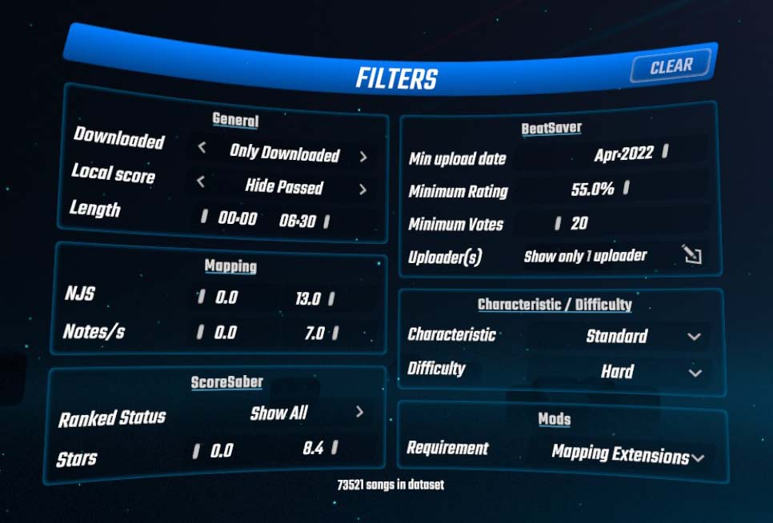
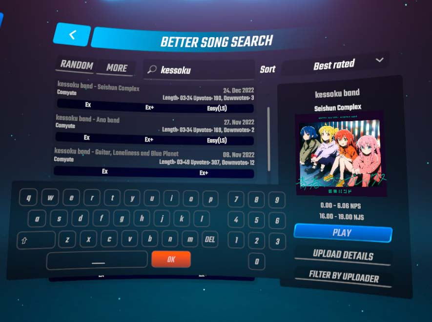
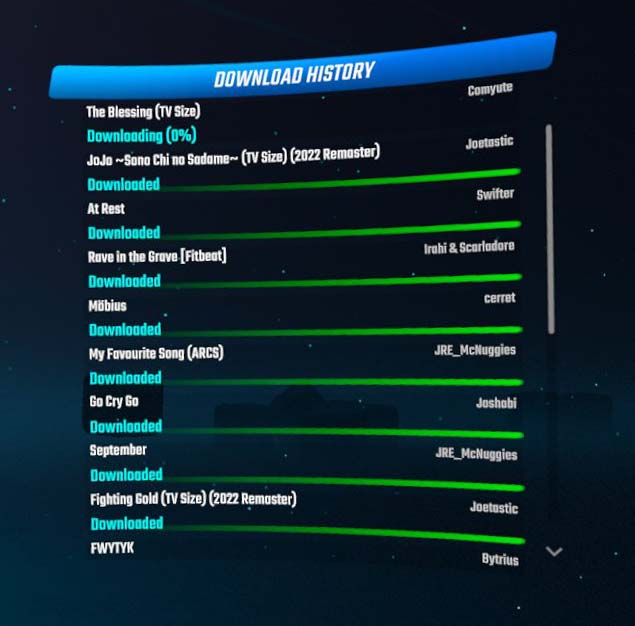

# Better Song Search

Searching, downloading and playing songs, now with 100% less annoying!

*This mod is a port of PC version of [BetterSongSearch](https://github.com/kinsi55/BeatSaber_BetterSongSearch) for Quest.*

## Features

- Wide variety of filtering / searching and sorting options
- Absolute banger of a UI that gives you as much information as possible at a single glance
- Preview of Songs that you havent downloaded yet 😮
- Uses a locally cached database (Via SongDetailsCache) so all inputs are reflected instantly-ish at the cost of being unable to find songs which have been uploaded in the last couple of hours
- Accessible while in a Multiplayer lobby!
- Button to pick random songs based off your filter settings if you're trying to discover new stuff
- Download queue / history which is kept until the game is closed
- Songs can directly be played from the search, no need to manually look for them after downloading
- If downloads fail for some reason they are retried

## Credits

* [FrozenAlex](https://github.com/FrozenAlex) - rewrote most of the project
* [Christoffyw](https://github.com/Christoffyw) - implemented multiple features
* [RedBrumbler](https://github.com/RedBrumbler) - BSML and SongDetails ports
* [Mello](https://www.pixiv.net/en/users/27903714) - author of the art used for the cover
* [Futuremappermydud](https://github.com/Futuremappermydud) - implemented filtering and sorting logic and some UI
* [FernTheDev](https://github.com/Fernthedev) - huge help with UI before the rewrite
* [zoller27osu](https://github.com/zoller27osu), [Sc2ad](https://github.com/Sc2ad) and [jakibaki](https://github.com/jakibaki) - [beatsaber-hook](https://github.com/sc2ad/beatsaber-hook)
* [raftario](https://github.com/raftario) 
* [Lauriethefish](https://github.com/Lauriethefish) and [danrouse](https://github.com/danrouse) for [this template](https://github.com/Lauriethefish/quest-mod-template)
* [kinsi55](https://github.com/kinsi55) - original mod author

## Screenshots

Filters | Main Screen | Download History
:-------------------------:|:-------------------------:|:-------------------------:
  |   |  
